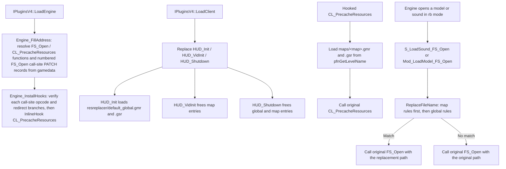

# ResourceReplacer

ResourceReplacer is a runtime resource-redirection plugin. Without modifying any file on disk, it
replaces model and sound load paths with configured paths through `.gmr` / `.gsr` rules. Replacement
happens at internal engine `FS_Open` call sites, and both plain and regular-expression rules are
supported.

## Provenance

This repository is the standalone ResourceReplacer plugin, extracted from MetaHookSv
(`Plugins/ResourceReplacer/`) into its own CMake workspace, aligned with the standalone Renderer,
PrecacheManager and HeapPatch projects. This note was migrated from MetaHookSv
`memory/ResourceReplacer.md` and adapted to the new layout: plugin sources moved to `src/`, the
original `MetaHook.sln` / `scripts/build-Plugins.bat` / `plugins_*.lst` integration was replaced by
CMake plus a self-owned gamedata catalog, and the user documentation now lives in
`docs/en/features.md` and `docs/zh-CN/features.md`. The `metahooksv` Basic Memory project belongs to
the source repository; notes here use the `resourcereplacer` project and the `resourcereplacer/`
permalink prefix.

## Responsibilities and entry points

- `src/plugins.cpp`: `IPluginsV4` lifecycle. `Init` stores the host API / interface / engine save;
  `LoadEngine` collects the file system (`FileSystem` or `FileSystem_HL25`), engine type/buildnum and
  `g_EngineDLLInfo.ImageBase`, copies `cl_enginefunc_t`, then runs `Engine_FillAddress()` followed by
  `Engine_InstallHooks()`; `LoadClient` takes over `HUD_VidInit`, `HUD_Init` and `HUD_Shutdown`;
  `ExitGame` calls `Engine_UninstallHooks()`. Exported through
  `EXPOSE_SINGLE_INTERFACE(IPluginsV4, IPluginsV4, METAHOOK_PLUGIN_API_VERSION_V4)`.
- `src/privatehook.cpp`: gamedata-only address discovery, call-site verification and redirection, and
  the wrapper functions that perform the actual replacement.
- `src/exportfuncs.cpp`: the three replaced client exports — global-rule loading, map-rule clearing
  and shutdown.
- `src/ResourceReplacer.cpp`: the rule layer (`CResourceReplacer`, `CPlainResourceReplaceEntry`,
  `CRegexResourceReplaceEntry`) and the two module-level instances returned by `ModelReplacer()` /
  `SoundReplacer()`.
- `src/util.cpp`: `TrimString`, `RemoveFileExtension` and `COM_FixSlashes` helpers.
- `src/ResourceReplacer.h`: the `IResourceReplacer` interface (`FreeMapEntries`, `FreeGlobalEntries`,
  `Shutdown`, `LoadGlobalReplaceList`, `LoadMapReplaceList`, `ReplaceFileName`).
- `src/plugins.h`, `src/privatehook.h`, `src/exportfuncs.h`, `src/enginedef.h`, `src/util.h`: globals,
  `private_funcs_t`, engine sound/`cache_user_t` layouts and declarations.

## Architecture

Rule layer:

- `CResourceReplacer` keeps `m_MapEntries` and `m_GlobalEntries`; entries are
  `CPlainResourceReplaceEntry` or `CRegexResourceReplaceEntry`.
- `LoadReplaceList` parses the file content line by line: `TrimString` first, then skip empty lines
  and lines starting with `#` or `/`; the two file names are read with `std::quoted` so quotes are
  optional; a third token equal to `regex` selects the regular-expression entry, otherwise the plain
  entry. Unparsable lines (a missing source or replacement) are silently skipped.
- Plain entries compare with `stricmp` — an exact, case-insensitive full-string match. Regex entries
  use `std::regex` with `std::regex::ECMAScript`, `std::regex_match` for the match (full string,
  case-sensitive) and `std::regex_replace` to build the result.
- Both entry types reject a replacement whose `V_GetFileExtension` differs from the source extension,
  so a `.mdl` rule can never redirect to a `.wav` target.
- `ReplaceFileName` iterates map entries first and global entries second, so map rules take priority.
- Rule files are read with `gEngfuncs.COM_LoadFile(name, 5, NULL)` and released with `COM_FreeFile`; a
  missing file only logs through `Con_DPrintf`.

Hook layer:

- `Engine_FillAddress` resolves `FS_Open` and `CL_PrecacheResources` as
  `MH_GAMESYMBOL_KIND_FUNCTION` and enumerates the numbered PATCH sets
  `S_LoadSound_to_FS_Open_callsite_0..N` and `Mod_LoadModel_to_FS_Open_callsite_0..N` through
  `IsGameSymbolAvailable` + `ResolveGameSymbol(..., MH_GAMESYMBOL_KIND_PATCH, ...)`.
- `RedirectCallSite` re-reads the target byte and accepts only `0xE8` / `0xE9` (five-byte `rel32`
  call / jmp) before calling `InlinePatchRedirectBranch`; anything else is reported through `Sys_Error`
  instead of being overwritten.
- `Mod_LoadModel_FS_Open` / `S_LoadSound_FS_Open` replace the path only when `pOptions` is exactly
  `"rb"`; every other open mode forwards to the original `FS_Open`.
- `CL_PrecacheResources` is taken over with `Install_InlineHook` and loads the map rule files derived
  from `pfnGetLevelName()` (extension removed, `.gmr` / `.gsr` appended), then calls the original.
- `Engine_UninstallHooks` only removes the `CL_PrecacheResources` inline hook; the redirected call
  branches are not restored.

## Dependencies

- **MetaHook API** (>= 110, enforced by a `static_assert` in `src/privatehook.cpp`):
  `IsGameSymbolAvailable`, `ResolveGameSymbol` with the FUNCTION and PATCH kinds, `GetModuleCRC64`,
  `GetGameSymbolStatusString`, `InlinePatchRedirectBranch`, `InlineHook` / `UnHook`, `GetEngineType`,
  `GetEngineBuildnum`, `GetEngineBase`, `SysError`.
- **Engine exports / interfaces**: `FS_Open`, `CL_PrecacheResources`, `cl_enginefunc_t`
  (`COM_LoadFile`, `COM_FreeFile`, `Con_DPrintf`, `pfnGetLevelName`) and `cl_exportfuncs_t`.
- **SourceSDK** (compiled from the MetaHook tree, not linked as a library): `strtools.h` /
  `V_GetFileExtension` and the tier0 / tier1 / vstdlib units listed in `cmake/Sources.cmake` —
  25 SDK compilation units plus the 5 plugin sources.
- **Capstone headers**: used indirectly through the MetaHook API for the gamedata PATCH records; the
  plugin does not link Capstone.
- **Build-only inputs**: MetaHook source tree (read-only) and VC-LTL 5.3.1.
- **Runtime data**: the shipped `metahook/gamedata/resourcereplacer` catalog, plus the user's own
  `resreplacer/default_global.gmr` / `.gsr` and `maps/<map>.gmr` / `.gsr` rule files, which the
  package does not provide.

## Repository layout

- `src/plugins.cpp`, `src/plugins.h` — plugin lifecycle, host API and shared globals.
- `src/privatehook.cpp`, `src/privatehook.h` — gamedata resolution, call-site redirection, wrappers.
- `src/ResourceReplacer.cpp`, `src/ResourceReplacer.h` — rule storage, parsing and matching.
- `src/exportfuncs.cpp`, `src/exportfuncs.h` — replaced `HUD_Init` / `HUD_VidInit` / `HUD_Shutdown`.
- `src/util.cpp`, `src/util.h`, `src/enginedef.h` — helpers and engine type definitions.
- `CMakeLists.txt`, `cmake/Sources.cmake` (explicit compile list), `cmake/Dependencies.cmake`,
  `cmake/VCLTL.cmake` — build.
- `scripts/build-ResourceReplacer-x86-{Debug,Release}.bat` — configure/build/install entry points.
- `scripts/manifests/resourcereplacer.json`, `scripts/sync-gamedata.py`,
  `scripts/validate-gamedata.py` — gamedata synchronization and validation.
- `docs/en/features.md`, `docs/zh-CN/features.md` — rule syntax, matching behavior and examples.
- `README.md`, `README.zh-CN.md` — install and build documentation. There is no test suite.

## Build and data flow

`scripts/build-ResourceReplacer-x86-{Debug,Release}.bat` → CMake (Visual Studio 17 2022,
`-A Win32`) → compile the DLL → install. The build uses MSVC x86 / C++20, a static CRT and VC-LTL
5.3.1, with the explicit compile list in `cmake/Sources.cmake` (5 plugin + 25 SDK units); the defines
include `NO_MALLOC_OVERRIDE` and `NO_VCR`, Debug compiles at `/W0` and Release at `/W3` with
`/wd4311 /wd4312 /wd4819 /wd4996`, and Release enables interprocedural optimization.
`scripts/manifests/resourcereplacer.json` → `scripts/sync-gamedata.py` → pruned catalog under
`build/x86/<Configuration>/assets/svencoop/metahook/gamedata/resourcereplacer`, validated by
`scripts/validate-gamedata.py` before the plugin target builds; disable with
`-DRESOURCEREPLACER_SYNC_GAMEDATA=OFF`.
The manifest declares the `FS_Open` and `CL_PrecacheResources` function symbols, the
`S_LoadSound_to_FS_Open_callsite_0` and `Mod_LoadModel_to_FS_Open_callsite_0` PATCH records, and
`numberedPatchSets` entries for both call-site prefixes, across 11 engine snapshots (`cof-5936`,
`hl-10210`, `hl-3248`, `hl-3266`, `hl-3329`, `hl-3647`, `hl-4554`, `hl-6153`, `hl-8684`,
`svencoop-10257`, `svencoop-8948`). Catalog coverage is not a validation statement.
Install output is `install/x86/<Configuration>/svencoop/metahook/{plugins,gamedata/resourcereplacer}`
(DLL plus PDB); nothing is deployed into the game automatically.

## Notes

- Address discovery is gamedata-only; there is no signature-scan fallback. An unknown engine build or
  a missing required symbol is reported through `Sys_Error` with symbol, module, buildnum, CRC64 and
  the status string.
- Each PATCH set must start at index 0 and is enumerated until the first missing index; a missing
  index 0 for either `S_LoadSound_to_FS_Open_callsite` or `Mod_LoadModel_to_FS_Open_callsite` is fatal.
- The opcode check detects a call site another writer already changed; it does not detect an existing
  `E8`/`E9` redirect installed by another plugin, which would be re-pointed.
- Replacement happens only for `pOptions == "rb"`; other open modes pass through untouched.
- Extensions must match before and after replacement, in both entry types; a rule that changes the
  extension never applies. This is the guard against cross-type resource replacement.
- The plugin never checks whether the replacement target exists. A rule pointing at a missing file
  makes the engine's own load fail later; nothing is logged by the plugin.
- Plain rules are full-string, case-insensitive; regex rules are full-string and case-sensitive by
  default. Regexes are compiled once per entry with the ECMAScript grammar.
- `LoadGlobalReplaceList` does not clear `m_GlobalEntries` before appending, so the design relies on
  `HUD_Init` running once per process; map entries are cleared in `HUD_VidInit`, so map rules do not
  accumulate across level changes.
- Map rule file names come from `pfnGetLevelName()` with the extension removed and `.gmr`/`.gsr`
  appended (`maps/foo.bsp` → `maps/foo.gmr`, `maps/foo.gsr`); an empty level name produces
  `.gmr`/`.gsr` and the lookup simply fails to load.

## Callers (optional)

- The host MetaHook loader drives `Init` / `LoadEngine` / `LoadClient` / `ExitGame`, loading
  `metahook/plugins/ResourceReplacer.dll` from `plugins.lst`.
- The client export chain calls the replaced `HUD_Init`, `HUD_VidInit` and `HUD_Shutdown`, and the
  engine's level-change path calls the hooked `CL_PrecacheResources`.
- The redirected internal engine call sites are the `FS_Open` branches in `S_LoadSound` and
  `Mod_LoadModel`, which now enter `S_LoadSound_FS_Open` / `Mod_LoadModel_FS_Open`.
- The host launcher merges `metahook/gamedata/resourcereplacer` into its gamedata catalog.

## External documentation

`README.md` is the English landing page and `README.zh-CN.md` the Chinese one; rule syntax and
matching behavior are documented in `docs/en/features.md` and `docs/zh-CN/features.md`.
